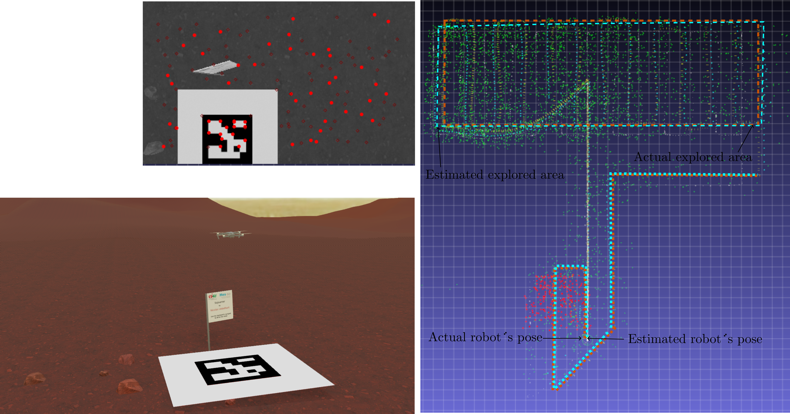

# Hybrid VSLAM

Ros 2 implementation of the Simultaneous Control Localization and Mapping (SCLAM) approach described in the paper:

"A SCLAM System for UAVs in GPS-denied Environments" (https://www.mdpi.com/2504-446X/9/1/69)
 




The Hybrid VSLAM is composed of the following ROS 2 components and nodes (See https://docs.ros.org/en/galactic/Concepts/About-Composition.html):


**ROS 2 components:** 

-  **Local SLAM** The local SLAM component implements a filter-based, visual SLAM system with a state vector size constrained to ensure real-time operation. On its own, this component generates up-to-metric-scale (world-referenced) estimates of both the robot's state and a local feature map. However, because older features are removed from the state vector to maintain real-time performance, previously visited areas of the environment cannot be recognized. Consequently, the accumulated positional drift cannot be corrected by this process alone.
- **Global SLAM** The global SLAM component processes keyframes produced by the local SLAM system to construct and maintain a global, persistent map of the environment. It also corrects accumulated drift when loops are detected. This component employs optimization-based techniques, such as bundle adjustment and graph-based SLAM, to achieve its objectives.
-  **Control**  The control component implements the following high-level control strategies as described in the paper: (i) waypoint control, (ii) visual marker-based control, (iii) area exploration, and (iv) return-to-home.
-  **Webot package** Defines the virtual environment (world) used for experiments, including the UAV (robot) and its low-level controller, simulated using the Webots platform.
-  **Webot bridge** This component interfaces certain sensor readings from the virtual robot with the format required by the SCLAM system.
- **Plot** The plot component implements a 3d scene of the robot's pose and trajectory as well as a map of visual features.


**ROS 2 nodes:**

- **Keyboard** Implements a simple command-line interface to interact with the Hybrid VSLAM application.


**Dependencies** (Tested in: Ubuntu 20.04)**:**

1.- ROS 2 (Galactic), https://docs.ros.org/en/galactic/index.html

2.- Armadillo C++ library (tested with version 11.0.1), http://arma.sourceforge.net/ .
    Armadillo requires BLAS/OPENBLAS and LAPACK libraries installed 

3.- OpenCV with extra modules installed (opencv_contrib) (tested with OpenCV version 4.2.0), https://opencv.org/ 
    The following OpenCV contrib modules are also required or recommended:
    - VIZ (Required). VIZ requires VTK support (tested with version 8.1.0).
    - SFM (Recommended). For SFM dependencies check: https://docs.opencv.org/4.x/db/db8/tutorial_sfm_installation.html Note. For compilling OpenCV with SFM, Ceres solver library http://ceres-solver.org/ version < 2.0 is required (tested with 1.14). 

4.- GTSAM c++ library (tested with version 4.1.1) https://gtsam.org/

5.- Webots Simulator (tested with version R2023a) https://cyberbotics.com/

**Usage:**

1.- Use colcon for compiling the project  (in the root project folder):  
```
source /opt/ros/galactic/setup.bash
colcon build --packages-select interfaces
. install/setup.bash
colcon build
colcon build
```

2.- After successfully compiling, launch the components using:
```
./launch.sh
```
At this point, the following elements must be launched: (i) the Webots virtual world, (ii) Viz-viewer, (iii) a terminal displaying the state of the Webots component, and (iv) a terminal showing the following menu:
```
|   'q' to quit.
|   's'-> Start/Stop SLAM          w-> Reset Control-SLAM
|   'a'-> Start/Stop Control Plan                
|   '-'-> zoom out '+' ->  zoom in '1'-> x-y view '2' -> x-z view  '3'->y-z view
|   '8'-> view up '5' ->  view down '4'-> view left '6' -> view right  '7'-> clear plot
|   '9'-> save screenshot '0' -> log statistics
|   't'-> TakeOff / landing 
|         r (forward)                  i (up)         
| d (left)          g(right)   j(turn L)     l (turn R) 
|         f (back)                     k(down)   
```
3.- In the last terminal, press the "a" key to start the control plan (the control plan can be modified in the control_plan.txt file).


*Notes:* The system parameters can be modified in the configuration file /config/quad_params.yaml to adjust the method's results and performance.